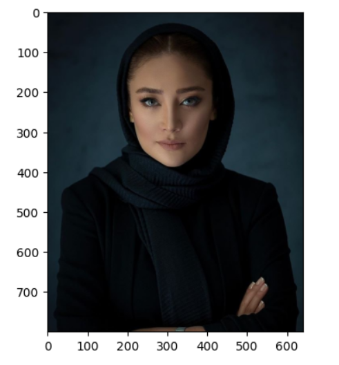
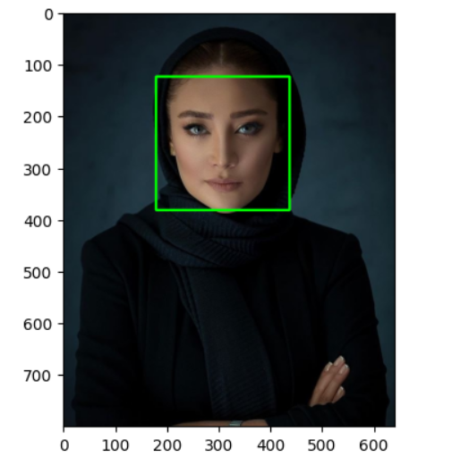

# Face_detection_opencv
A simple face detection project built with Python and OpenCV.
The project uses a pre-trained Haar Cascade classifier to detect frontal human faces in images and visualize the detected faces using bounding boxes.
## Demo
### Input

### Output

### Features
- Detect frontal human faces
- Draw bounding boxes around detected face
- Use a pre-trained Haar Cascade classifier
### Technologies
- Python
- OpenCV
- Matplotlib
- Haar Cascade Classifier
### How It Works
The face detection process consists of several steps:
1. Upload an image.
2. Detect faces using `detectMultiScale()`.
3. Extract the coordinates of detected faces.
4. Draw bounding boxes around the detected faces.
5. Display the processed image.
